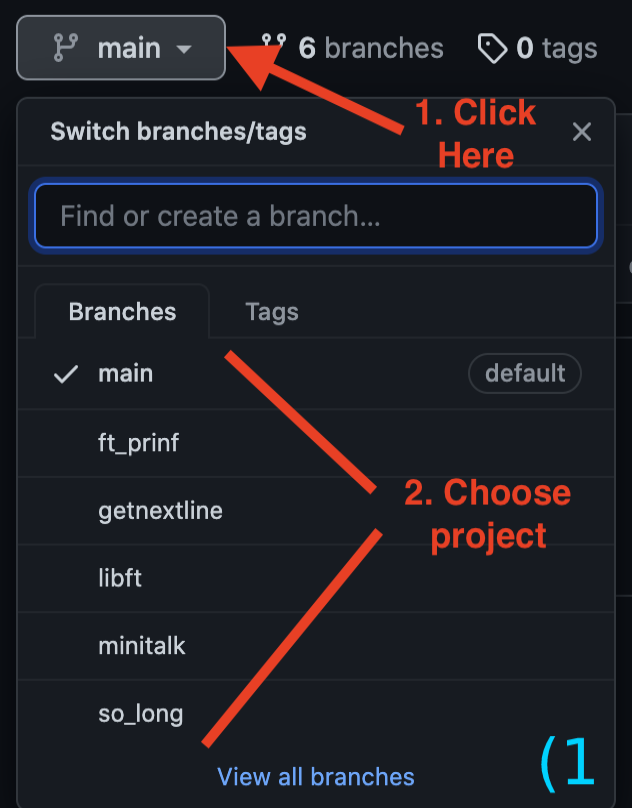
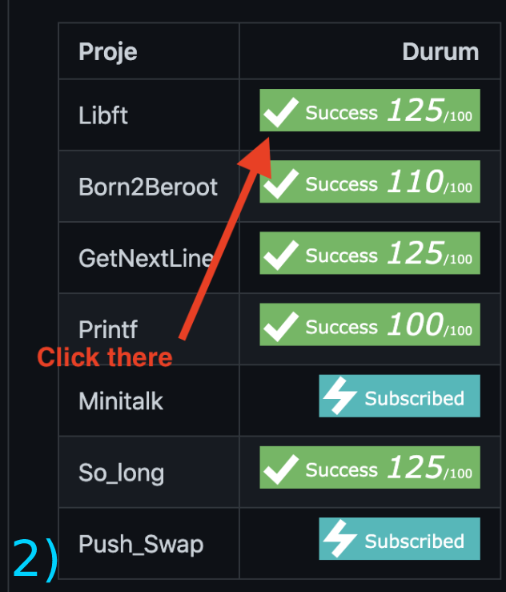
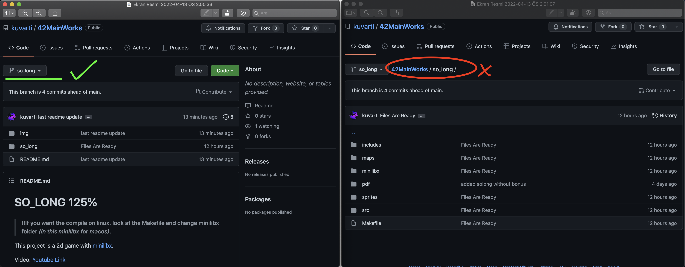

# **This is aeryilma's 42 adventure**
> #### Do down for [Repository Guide](#how-to-see-projetcs)
 
<!-- https://badge42.vercel.app/ -->

<table>
<tr><th> Project </th><th> Tables </th></tr>
<tr><td>

| Proje | Durum |
| :-	|	-:	|
| Libft | |
| Born2Beroot| |
| GetNextLine| |
| Printf| |

</td><td>

| Proje | Durum |
| :-	|	-:	|
| Minitalk| |
| So_long| |
| Push_Swap| |
| ExamRank02| NotRegisteredYet|

</td></tr> </table>

### **How to see projetcs**
There is 2 way to explore projects;

>|||
>|:-|-:|

> **!!Do not switch branch in folder.**

