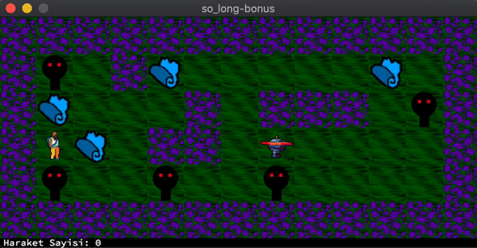

# **SO_LONG 125%**

>**!!If you want the compile on linux, look at the Makefile and change minilibx folder _(in this minilibx for macos)_.**

This project is a 2d game with [minilibx](https://github.com/42Paris/minilibx-linux).

Video:
[Youtube Link](https://youtu.be/mtf2UV0kqT0)

### **so_long**:
<!---->

### **so_long-bonus**

